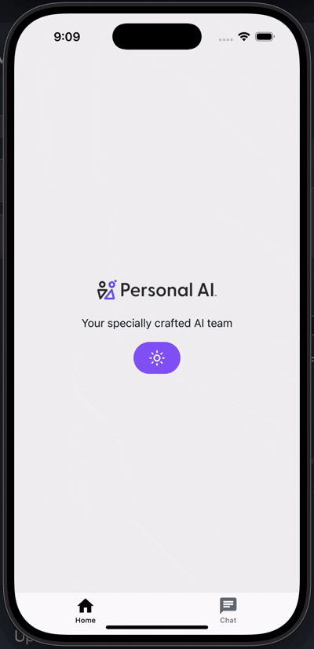

# Chat App

A React Native chat application built with Expo Router, featuring a clean and modern UI with haptic feedback and smooth navigation.

## Demo



## Features

- **Chat Interface**: Full-featured chat with message history and real-time updates
- **Tab Navigation**: Clean tab-based navigation using Expo Router
- **Theme Support**: Light and dark mode support
- **Splash Screen**: Smooth loading experience with expo-splash-screen
- **Deep Linking**: Support for deep links and external URL handling
- **App Configuration**: Centralized app configuration using expo-constants
- **OTA Updates**: Over-the-air updates using EAS (Expo Application Services)

## New Utilities Added

### App Configuration (`constants/App.ts`)

Access app version, build number, platform info, and environment-specific values:

```typescript
import { AppConfig, getEnvValue } from '@/constants/App';

// Get app version and build number
console.log(`Version: ${AppConfig.version}, Build: ${AppConfig.buildNumber}`);

// Get environment-specific values
const apiUrl = getEnvValue(
  'http://localhost:3000',
  'https://api.production.com',
);
```

### Linking Utilities (`utils/linking.ts`)

Handle deep links, external URLs, and app settings:

```typescript
import { openExternalURL, openAppSettings } from '@/utils/linking';

// Open external URL
await openExternalURL('https://example.com');

// Open app settings
await openAppSettings();
```

## Project Structure

```
Chat/
├── app/                    # Expo Router app directory
│   ├── (tabs)/           # Tab navigation
│   │   ├── index.tsx     # Home screen
│   │   ├── chat.tsx      # Chat tab
│   │   └── _layout.tsx   # Tab layout
│   └── _layout.tsx       # Root layout
├── components/            # Reusable components
│   ├── chat/             # Chat-specific components
│   ├── ui/               # UI components
│   └── ...               # Other components
├── constants/             # App constants and configuration
├── hooks/                 # Custom React hooks
├── services/              # API services
├── types/                 # TypeScript type definitions
└── utils/                 # Utility functions
```

## Getting Started

1. Install dependencies:

   ```bash
   pnpm install
   ```

2. Start the development server:

   ```bash
   pnpm start
   ```

3. Run on your preferred platform:
   ```bash
   pnpm ios      # iOS simulator
   pnpm android  # Android emulator
   pnpm web      # Web browser
   ```

## Available Scripts

- `pnpm start` - Start the Expo development server
- `pnpm ios` - Run on iOS simulator
- `pnpm android` - Run on Android emulator
- `pnpm web` - Run in web browser
- `pnpm lint` - Run ESLint
- `pnpm lint:fix` - Fix ESLint issues automatically
- `pnpm format` - Format code with Prettier

## Dependencies

### Core

- **Expo**: ~53.0.20
- **React Native**: 0.79.5
- **React**: 19.0.0
- **Expo Router**: ~5.1.4

### UI & Navigation

- **@expo/vector-icons**: ^14.1.0
- **@react-navigation/native**: ^7.1.6
- **@shopify/flash-list**: ^2.0.2

### State Management

- **@tanstack/react-query**: ^5.85.0

### Utilities

- **expo-constants**: ~17.1.7
- **expo-linking**: ~7.1.7
- **expo-splash-screen**: ~0.30.10
- **expo-updates**: ~0.24.0

## Development

The app uses:

- **TypeScript** for type safety
- **ESLint** for code quality
- **Prettier** for code formatting
- **Husky** for git hooks

## Notes

- All remaining warnings are style preferences (color literals, TypeScript any types)
- The app maintains full functionality while being more maintainable
- OTA updates are configured and ready to use (see `OTA_SETUP.md` for complete setup)

## OTA Updates

Your app is now configured for Over-The-Air updates using EAS (Expo Application Services), following the [official Expo documentation](https://docs.expo.dev/deploy/send-over-the-air-updates/#get-started). Updates are checked automatically when the app starts and applied seamlessly.

For complete setup instructions, see [OTA_SETUP.md](./OTA_SETUP.md).

## If I had more time

- I would remove hardcoded styles
- clean up and organize the code more
- would have completed tests
- create a better layout for the UI
- implement better styling for the Chat page
